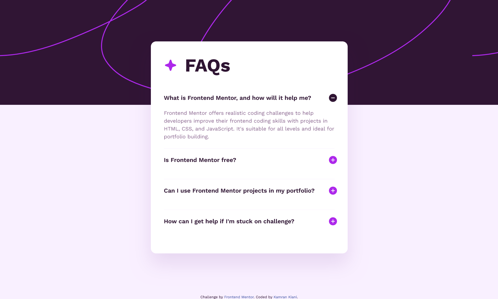

# Frontend Mentor - FAQ accordion

This is a solution to the [FAQ accordion challenge on Frontend Mentor](https://www.frontendmentor.io/challenges/faq-accordion-wyfFdeBwBz).

## Table of contents

- [Frontend Mentor - FAQ accordion](#frontend-mentor---faq-accordion)
  - [Table of contents](#table-of-contents)
  - [Overview](#overview)
    - [The challenge](#the-challenge)
    - [Screenshot](#screenshot)
    - [Links](#links)
  - [My process](#my-process)
    - [Built with](#built-with)
    - [What I learned](#what-i-learned)
    - [Useful resources](#useful-resources)
  - [Author](#author)

## Overview

### The challenge

Users should be able to:

- Hide/Show the answer to a question when the question is clicked
- Navigate the questions and hide/show answers using keyboard navigation alone
- View the optimal layout for the interface depending on their device's screen size
- See hover and focus states for all interactive elements on the page

### Screenshot

### Links

- Solution URL: [solution URL](https://github.com/kaamiik/FAQ-Accordion)
- Live Site URL: [live site URL](https://faq-accordion-iota-jade.vercel.app/)

## My process

### Built with

- Semantic HTML5 markup
- CSS custom properties
- Flexbox

### What I learned

I worked with media query for using this page on Desktop and Mobile screen sizes. i've add an anchor tag to my label and the href with the id of content so you can work with keybord to navigate. finally i learned how to use accordion with HTML, CSS and JS and how to change image icon plus and minus using ::before pseudo class.

To see how you can add code snippets, see below:

### Useful resources

- [Build an accordion menu](https://www.freecodecamp.org/news/build-an-accordion-menu-using-html-css-and-javascript/) - This helped me for accordion menu.

## Author

- Frontend Mentor - [@kaamiik](https://www.frontendmentor.io/profile/kaamiik)
